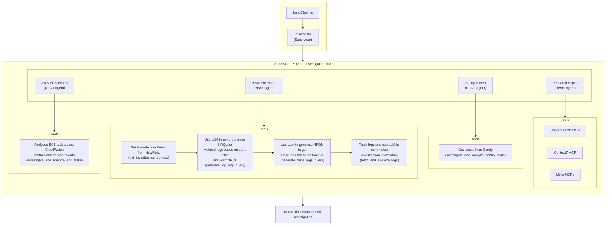
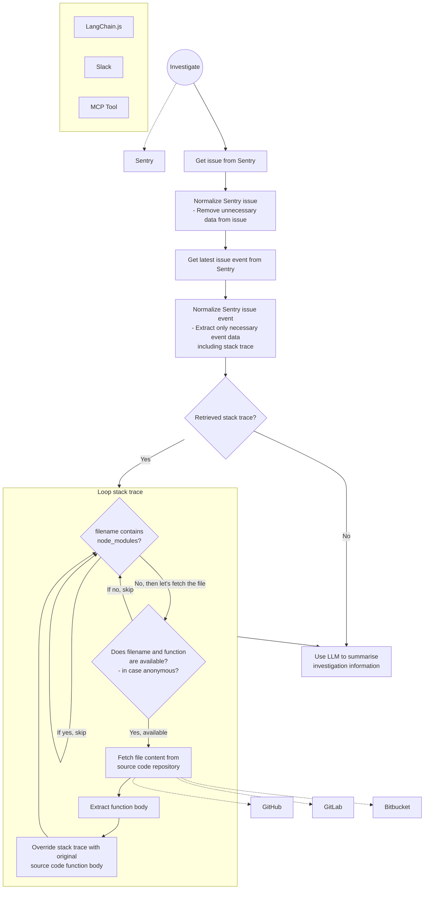
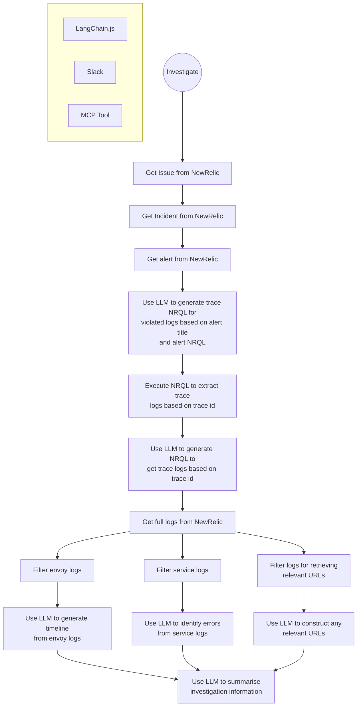
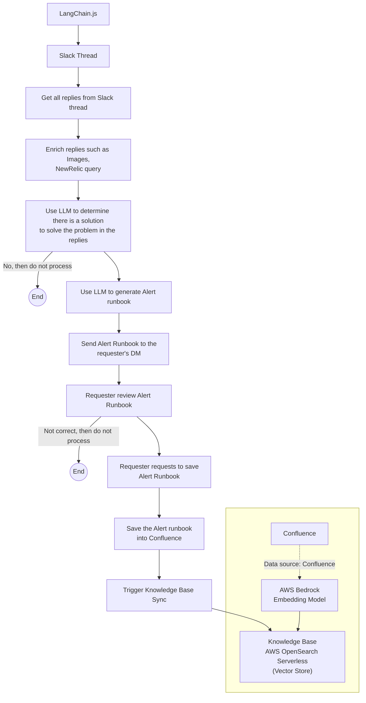
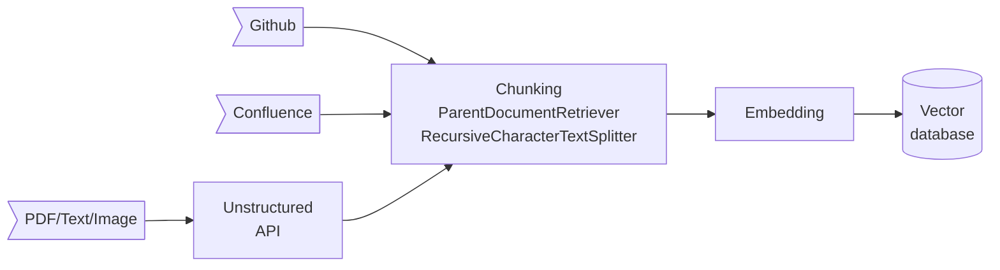
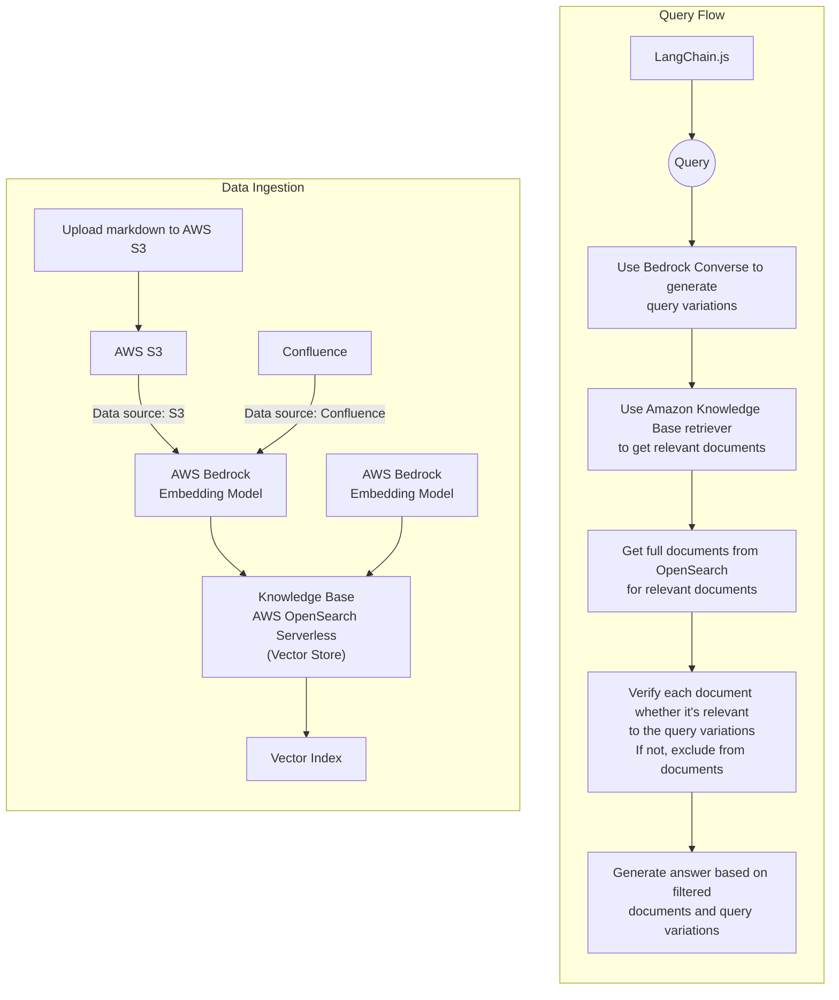
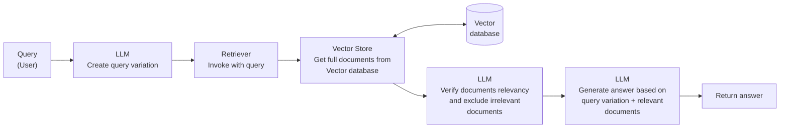

# A LangChain playground using TypeScript

A playground for LangChain.js, LangGraph, Slack, Model Context Protocol (MCP) and other LLM-related tools.

This project provides both REST API endpoints or Slack bot integration for interacting with different language models and LangChain and LangGraph workflows.

## Architecture

### Core components

- [langchain.js](https://js.langchain.com/): Framework for building applications with LLMs.
- [langgraph](https://langchain-ai.github.io/langgraphjs/): Framework for building applications with advanced workflow orchestration for multi-step processes.
- [slack/bolt](https://www.npmjs.com/package/@slack/bolt): Integration with Slack for building Slack apps.
- [Model Context Protocol (MCP)](https://modelcontextprotocol.io/): MCP is a protocol for building LLM-powered tools.

### LLM providers

- [openai](https://openai.com/)
- [ollama](https://ollama.com/)
- [groq](https://groq.com/)

### Document Loaders

- [DirectoryLoader](https://js.langchain.com/docs/integrations/document_loaders/file_loaders/directory/): Loads documents from a directory via Unstructured API.
- [ConfluenceLoader](https://js.langchain.com/docs/integrations/document_loaders/web_loaders/confluence/): Loads documents from Confluence.
- [RecursiveCharacterTextSplitter](https://js.langchain.com/docs/how_to/code_splitter/#markdown): Splits documents into chunks of text.
- [GitHubLoader](https://js.langchain.com/docs/integrations/document_loaders/web_loaders/github/): TODO.

### Services

- [ollama](https://ollama.com/): Ollama enables the execution of LLM models locally.
- [openweb-ui](https://docs.openwebui.com/): OpenWeb UI is a self-hosted WebUI that interacts with Ollama.
- [unstructured-api](https://github.com/Unstructured-IO/unstructured-api): The Unstructured API is designed to ingest/digest files of various types and sizes.
- [qdrant](https://qdrant.tech/): Qdrant serves as a vector database.
- [chroma](https://www.trychroma.com/): Chroma serves as an embedding database. Not used anymore.
- [redis](https://redis.io/): Redis is an open-source in-memory data structure store.
- [chunkhound](https://chunkhound.github.io/): ChunkHound provides semantic code search and architecture analysis via MCP.

## Server mode

- `fastify`: serves as a web server in `src/api`
- `slack`: serves as a Slack app in `src/slack`

## Multi-Agent Investigation System

In this project, I used LangGraph Supervisor to build a multi-agent investigation system.

Refer to [Multi-agent](https://docs.langchain.com/oss/javascript/langchain/multi-agent) for more details.

**Supervisor** coordinates six specialized domain agents:

| Agent | Purpose | Tools |
|-------|---------|-------|
| **New Relic Expert** | Alerts, logs, APM data | NRQL queries, log analysis, trace correlation |
| **Sentry Expert** | Error tracking, crashes | Issue lookup, event analysis, stack traces |
| **Research Expert** | External documentation | Brave Search, Context7, Kubernetes (MCP) |
| **AWS ECS Expert** | AWS ECS | ECS task status, container health, CloudWatch Container Insights metrics, service deployment, task placement, historical task event lookup, container exit codes, performance bottleneck analysis |
| **AWS RDS Expert** | AWS RDS monitoring | RDS instance status, Performance Insights, CloudWatch metrics, top SQL queries |
| **Code Research Expert** | Codebase analysis | ChunkHound semantic search, regex patterns, architecture analysis |

**Workflow**:

1. **Analyze** - Supervisor determines relevant domain(s) from the query
2. **Delegate** - Routes to appropriate domain agent(s) in parallel or sequence
3. **Synthesize** - Combines findings into a unified `InvestigationSummary`
4. **Return** - Structured response with root cause, impact, and recommendations

**Key Features**:

- **Recursion limit protection** - Prevents infinite agent loops
- **Timeout protection** - Configurable per-request and per-step timeouts
- **Cost tracking** - Token usage and cost calculation via callbacks



## Sentry alert analysis

In this project, I used LangGraph to build a workflow to analyze Sentry alert.

The workflow in big picture is as follows:

1. Get Sentry issue and first event
2. Normalize the issue and event and extend the stacktrace to source code fetching from GitHub
3. Generate a summary of the investigation using the normalized issue and event



## New Relic log analysis

In this project, I used LangGraph to build a workflow to analyze New Relic logs.

The workflow in big picture is as follows:

1. Get New Relic logs
2. Analyze New Relic logs to get the request timeline, service error logs and relevant URLs
3. Generate a summary of the investigation by analyzing the request timeline, service error logs and relevant URLs



## Generate Alert Runbook from Slack thread

The idea of this workflow is to generate Alert Runbook from Slack thread and send it to the user. Once the user approves the Alert Runbook, then RCA will be added to the Alert Runbook.

The workflow in big picture is as follows:

1. Get all replies from Slack thread
2. Enrich replies such as images, NewRelic query, etc.
3. Use LLM to determine there is a solution to solve the problem in the replies
4. Use LLM to generate Alert Runbook from the replies and solution
5. Send the Alert Runbook to the user for approval
6. If the user approves the Alert Runbook, then RCA will be added to the Alert Runbook.



## Answer from Retriever-Augmented Generation (RAG)

In this project, there are following routes to answer user's question from the document RAG retrieval.

Routes:

- `DELETE /document/reset`: Reset the document RAG retrieval.
- `PUT /document/load/directory`: Load documents from a directory using Unstructured API + Parent document retriever.
- `PUT /document/load/confluence`: Load documents from Confluence + Parent document retriever.
- `POST /document/query`: Answer user's question from the document RAG retrieval.

### Document loader process



### Document query process

#### AWS Bedrock Knowledge Base



#### Parent document retriever



## Slack integration

In this project, I used [slack/bolt](https://www.npmjs.com/package/@slack/bolt) and LangGraph to build a Slack app.

- When a user mentions the bot in a channel, the bot will respond with a message.
- It will execute the following steps:
  - Intent classifier: Classify the intent of the user's message.
  - Intent router: Route the user's message to the appropriate node.
  - Get message history: Get the message history of the channel.
  - MCP tools: Use MCP tools to get information from Model Context Protocol.
  - Summarise thread: Summarise the thread.
  - Translate message: Translate the message to the user's language.
  - Find information: Find information from the RAG database.
  - General response: Generate a general response.
  - Final response: Respond to the user's message.

## How to start

```bash
docker-compose up -d --build
```

### Prerequisites for ChunkHound (Code Research)

If using the Code Research agent, ensure Ollama has the required models:

```bash
# Required for ChunkHound embeddings and LLM
ollama pull mxbai-embed-large:latest
ollama pull llama3.1:8b
```

Then enable ChunkHound in your `.env`:

```bash
CHUNKHOUND_ENABLED=true
GITHUB_REPOSITORIES_ENABLED=true
```

## Endpoints

### Multi-Agent Investigation

- `POST /agent/investigate` - Unified investigation using domain agents

### Document Management (RAG)

- `DELETE /document/reset` - Reset document store
- `PUT /document/load/directory` - Load documents from directory
- `PUT /document/load/confluence` - Load from Confluence
- `POST /document/query` - Query documents with RAG

### LLM Provider Threads

- `POST /{provider}/thread` - Create conversation thread (openai, groq, ollama)
- `GET|POST /{provider}/thread/:id` - Get/continue specific thread

### LangGraph Workflows

- `POST /langgraph/thread` - Create LangGraph workflow thread
- `POST /langgraph/newrelic/investigate` - New Relic log analysis
- `POST /langgraph/sentry/investigate` - Sentry issue investigation

### Health

- `GET /health` - Health check

## Todo

- [ ] Add more examples
- [ ] Add tests
- [ ] Make better documentations
