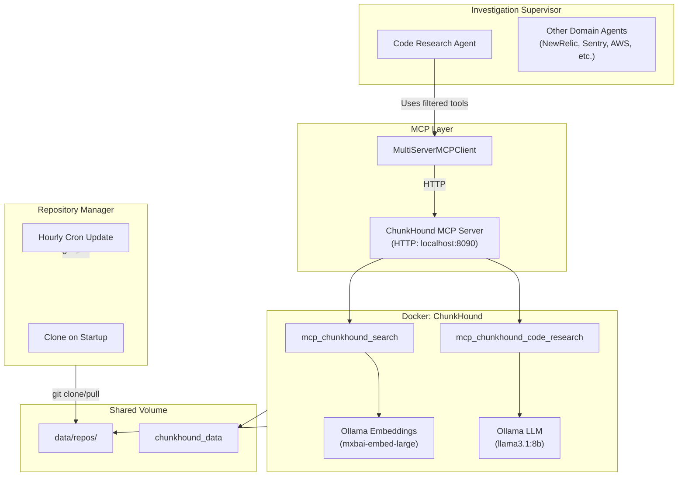
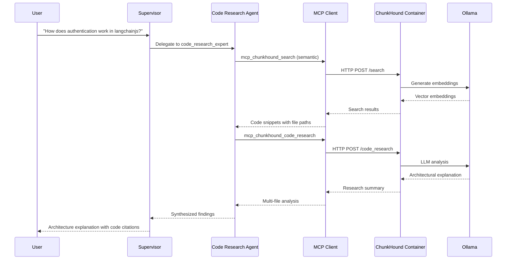

# Code Research Domain Agent

A domain agent for deep codebase analysis using [ChunkHound](https://chunkhound.github.io/) MCP tools. This agent provides semantic code search, regex pattern matching, and multi-file architecture analysis capabilities.

## Architecture



## Components

### Tools

| Tool | Description | Use Case |
|------|-------------|----------|
| `mcp_chunkhound_search` | Regex and semantic code search | Finding function definitions, imports, patterns |
| `mcp_chunkhound_code_research` | Deep multi-file architecture analysis | Understanding component relationships, architectural questions |

### System Prompt (`prompts.ts`)

The agent uses a structured prompt with:

- **Autonomous mode** - Completes research without user confirmation
- **Tool guidance** - When to use regex vs semantic search
- **Workflow phases** - Understand → Search → Synthesize
- **Error handling** - Graceful degradation strategies

## Configuration

### Enable ChunkHound

```bash
# .env
CHUNKHOUND_ENABLED=true
CHUNKHOUND_URL=http://localhost:8090
```

### Configure Repositories

```bash
# .env
GITHUB_REPOSITORIES_ENABLED=true
GITHUB_REPOSITORIES_REPOS='[{"owner":"langchain-ai","repo":"langchainjs","branch":"main"}]'
```

## Data Flow



## Prerequisites

1. **ChunkHound container running**:

   ```bash
   docker-compose up -d chunkhound
   ```

2. **Ollama models available** on host:

   ```bash
   ollama pull mxbai-embed-large:latest  # Embeddings
   ollama pull llama3.1:8b               # Code research LLM
   ```

3. **Repositories cloned** to `data/repos/`:
   - Automatic on server startup if `GITHUB_REPOSITORIES_ENABLED=true`
   - Or manually: `git clone <repo> data/repos/<owner>/<repo>`

## Testing with curl

The Code Research agent is accessed via the Investigation Supervisor endpoint. The supervisor automatically routes code-related queries to the `code_research_expert` agent.

### Basic Code Research Query

```bash
curl -X POST http://localhost:8080/agent/investigate \
  -H "Content-Type: application/json" \
  -d '{
    "query": "How does the createReactAgent function work in the langchainjs repository?"
  }'
```

### Architecture Analysis

```bash
curl -X POST http://localhost:8080/agent/investigate \
  -H "Content-Type: application/json" \
  -d '{
    "query": "Explain the architecture of the MCP client implementation. How are multiple servers managed?"
  }'
```

### With Configuration Overrides

```bash
curl -X POST http://localhost:8080/agent/investigate \
  -H "Content-Type: application/json" \
  -d '{
    "query": "Find all usages of StructuredTool in the codebase",
    "config": {
      "provider": "openai",
      "model": "gpt-4o",
      "temperature": 0,
      "timeoutMs": 120000,
      "verboseLogging": true
    }
  }'
```

### Example Response

```json
{
  "summary": "The createReactAgent function creates a ReAct agent...",
  "findings": [
    {
      "agent": "code_research_expert",
      "result": "Found in src/api/agent/domains/code-research/agent.ts:34-45..."
    }
  ],
  "recommendations": ["..."],
  "usage": {
    "totalTokens": 1234,
    "estimatedCost": 0.0123
  }
}
```

### Debugging Tips

1. **Check ChunkHound is running**:

   ```bash
   curl http://localhost:8090/health
   ```

2. **Verify repositories are cloned**:

   ```bash
   ls -la data/repos/
   ```

3. **Check server logs** for agent routing:

   ```bash
   npm run dev  # Watch logs for "Creating Code Research agent"
   ```

## Related Files

- `src/libraries/github/repositoryManager.ts` - Git clone/pull scheduler
- `src/libraries/mcp/mcpClient.ts` - ChunkHound MCP configuration
- `docker-compose.yml` - ChunkHound container definition
- `Dockerfile.chunkhound` - ChunkHound image build
